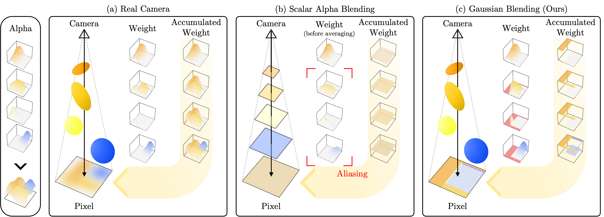

# <p align="center"> **Gaussian Blending**<br>Rethinking Alpha Blending in 3D Gaussian Splatting<br>[AAAI 2026] </p>

####  <p align="center"> [Junseo Koo](https://1207koo.github.io), [Jinseo Jeong](https://www.jinseo.kr), [Gunhee Kim](https://vision.snu.ac.kr/gunhee)</p>

#### <p align="center">[Paper (coming soon)]() | [arXiv (coming soon)]() | [Project Page](https://1207koo.github.io/html/gaussianblending/)</p>

## Appendix
The recent introduction of 3D Gaussian Splatting (3DGS) has significantly advanced novel view synthesis.
Several studies have further improved the rendering quality of 3DGS, yet they still exhibit noticeable visual discrepancies when synthesizing views at sampling rates unseen during training.
Specifically, they suffer from (i) erosion-induced blurring artifacts when zooming in and (ii) dilation-induced staircase artifacts when zooming out.
We speculate that these artifacts arise from the fundamental limitation of the alpha blending adopted in 3DGS methods.

Instead of the conventional alpha blending that computes alpha and transmittance as scalar quantities over a pixel, we propose to replace it with our novel \textit{Gaussian Blending} that treats alpha and transmittance as spatially varying distributions.
Thus, transmittances can be updated considering the spatial distribution of alpha values across the pixel area, allowing nearby background splats to contribute to the final rendering.

Our Gaussian Blending maintains real-time rendering speed and requires no additional memory cost, while being easily integrated as a drop-in replacement into existing 3DGS-based or other NVS frameworks.
Extensive experiments demonstrate that Gaussian Blending effectively captures fine details at various sampling rates unseen during training, consistently outperforming existing novel view synthesis models across both unseen and seen sampling rates.

<p align="center">
  
</p>


## Note
We are in the process of preparing the code release. **The code will be made available soon!**


## Citation
```txt
@inproceedings{koo2026gb,
    author = {Koo, Junseo and Jeong, Jinseo and Kim, Gunhee},
    title  = {{Gaussian Blending: Rethinking Alpha Blending in 3D Gaussian Splatting}},
    booktitle = {Proceedings of the AAAI conference on artificial intelligence},
    year = {2026},
}
```
